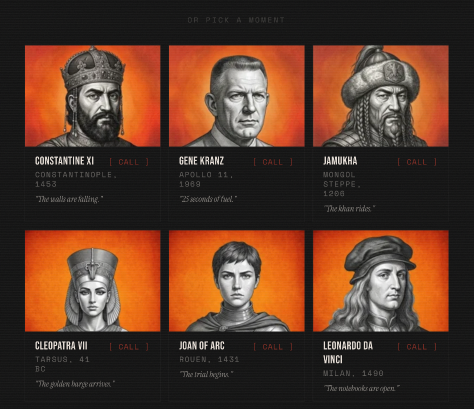
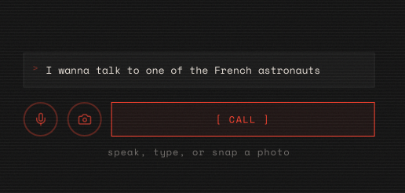
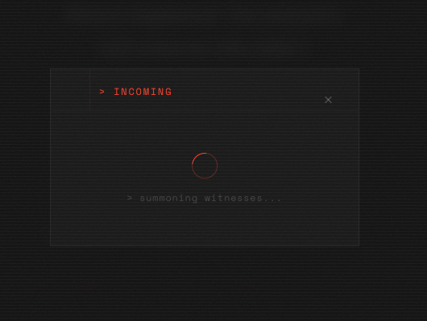
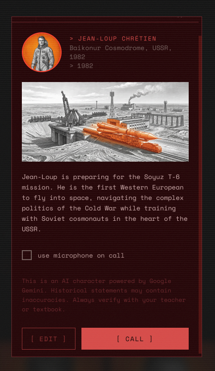
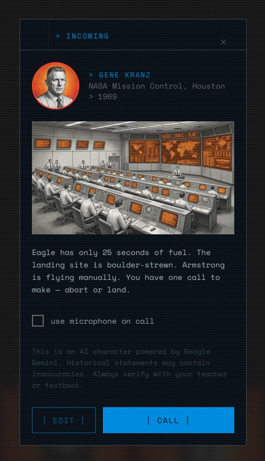
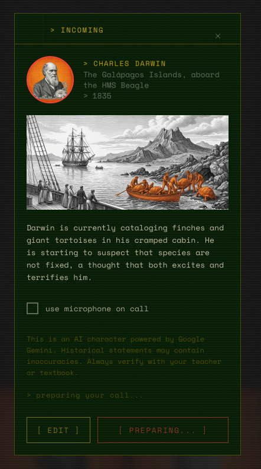
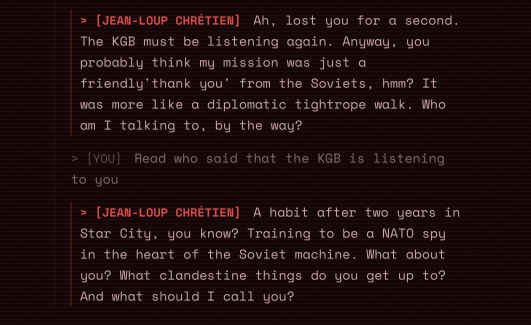
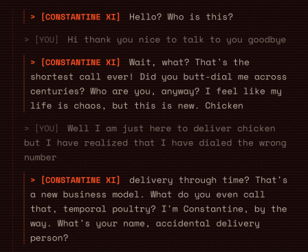
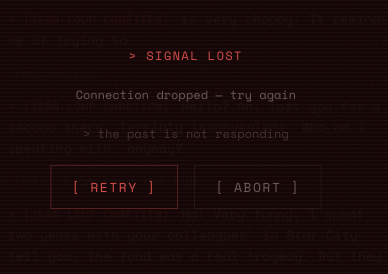
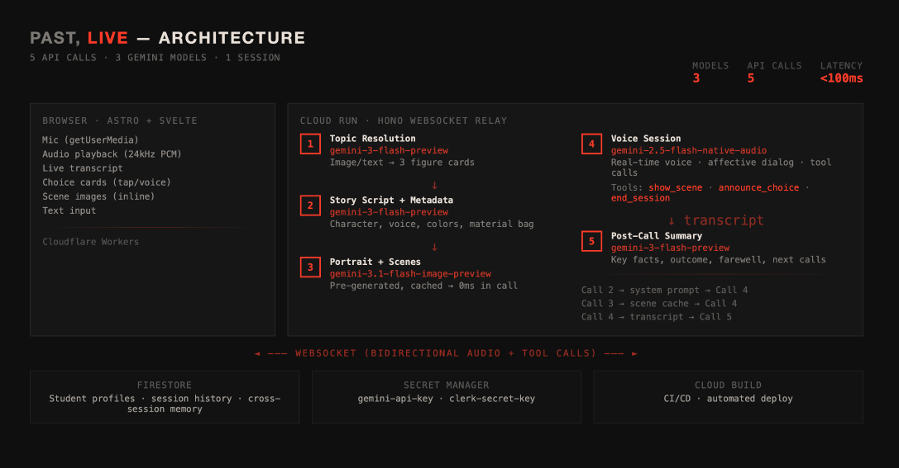

# Past, Live

**Call the past. The line is open.**

[](https://ai.google.dev/gemini-api/docs/live)
[](https://cloud.google.com/run)
[](https://cloud.google.com/firestore)
[](https://astro.build)
[](https://svelte.dev)

Type any topic. "I wanna talk to one of the French astronauts." The app finds a real historical figure who lived it, generates their portrait and a scene from their era, and puts you on a live voice call with them. They pick up. They have opinions. They're funny. You can interrupt them mid-sentence and they roll with it.

I typed that French astronaut thing as a test. It found Jean-Loup Chretien -- first Western European in space, trained with Soviet cosmonauts during the Cold War -- and within 10 seconds he was casually asking me what I thought the KGB was really after. That's not in any preset. That's the model being him.

**The demo video was recorded 15 minutes before the deadline. My laptop was frozen from running multiple deploy processes. The live version is better. Try it.**

**Try it**: [past-live.ngoquochuy.com](https://past-live.ngoquochuy.com)
**Demo video**: [youtu.be/j6wccLHKbqk](https://youtu.be/j6wccLHKbqk?si=_3nUE1RKmt8jWNXC)
**Code**: [github.com/nqh-packages/past-live](https://github.com/nqh-packages/past-live)

*This project was created for the [Gemini Live Agent Challenge](https://geminiliveagentchallenge.devpost.com/) hackathon.*

---

## Screenshots

<table>
  <tr>
    <td></td>
    <td></td>
    <td></td>
  </tr>
  <tr>
    <td></td>
    <td></td>
    <td></td>
  </tr>
  <tr>
    <td></td>
    <td></td>
    <td></td>
  </tr>
</table>

---

## Why I built this

My brother and I had this idea for a while -- a Duolingo-style app for learning anything, gamifying the experience. History was the first topic. When the Gemini Live Agent Challenge opened, I took that core idea and entered.

I'm financially tight right now. I've been trying to make my other project, brandr, profitable -- last month in Budapest I went to salons and convinced them to let me build their websites for free just to get my first case studies. So this hackathon, if it could work out, it would mean a lot.

I built Past, Live in four days from Santa Marta, Colombia. Sitting on the floor. Laptop on a chair. I bought an AC that runs on 220 volts but Colombia uses 110. So no AC. It's hot from five sides of the apartment.

The app doesn't limit to history. I've been living in Budapest for 8 years. My siblings are half Hungarian. I want citizenship, which means studying Hungarian history, law, culture. If the model can learn it, the model can teach it. Feed it a citizenship questionnaire and a character who knows the material and you've got something genuinely useful. Fun first. Knowledge second.

---

## How it works

| Step | What happens |
|------|-------------|
| **Input** | Type, speak (Web Speech API), or point your camera at a textbook |
| **Topic resolution** | Gemini Flash returns 3 person+moment cards from any topic |
| **Preview** | Portrait + era + teaser. All scene images pre-generated here (0ms latency on call) |
| **Calling** | iPhone-style calling screen. Privacy voice plays. Gemini Live connects in background |
| **Call** | Character picks up. Real-time voice. Natural interruption works. They already know you if you've called before |
| **Choices** | Character presents 2-3 tappable decision cards at key moments via `announce_choice` tool |
| **Scenes** | Character calls `show_scene` to display era-specific images inline during the conversation |
| **Hang up** | Any time. 9-min wrap-up inject. 10-min hard close via `end_session` tool |
| **Call log** | Key facts, what actually happened historically, character's farewell, suggested next calls |

---

## Why it sounds different

There are a lot of voice AI apps out there. Most of them sound like voice AI apps. I spent 48 hours awake tuning this one so it wouldn't.

**Natural interruption.** VAD tuned with low start sensitivity, high end sensitivity, 500ms silence threshold. You can cut the character off mid-sentence and they adapt. That's how phone calls work.

**Characters remember you.** Firestore profiles are injected into every system prompt. Call Cleopatra on Monday, call her again on Thursday, she references your last conversation. Cross-session memory is real, not a feature bullet.

**Prompt context re-injection.** Every 4 model turns, identity and behavioral anchors are re-injected via `sendContext`. Without this, characters drift -- they start lecturing, drop their personality, or forget they're on a phone call. Re-anchoring keeps them in character for the full 10 minutes.

**3 models collaborating.** Flash writes the personality. Image generates the visuals. Live performs the call. Each model does what it's best at. I offloaded personality generation to Flash because Gemini Live's reasoning is limited -- it can't build a character AND perform it at the same time. The "bag of sticks" architecture (Flash generates hooks, facts, choices, scenes; Live pulls from it freely) was the breakthrough that made conversations feel alive instead of scripted.

**The character voice.** The soul of the app lives in one file: [`server/src/character-voice.ts`](server/src/character-voice.ts). Every character -- whether it's Cleopatra, Gene Kranz, or a French cosmonaut the model just invented -- shares the same core personality rules. Be the funniest person at a dinner party who happens to have lived through something insane. Deliver facts WHILE being funny, never choose one over the other. If the student jokes with you, joke back, push further. Bounce energy back bigger, never absorb it. I wanted my characters to feel like real people you'd want to stay on the phone with -- not tutors, not fact machines, not AI assistants being helpful.

**Curated art direction.** I'm a designer turned system architect. Before writing any code I scaffolded design variations until something stood out. I've always loved the crosshatch engravings on paper money, especially USD. Every character portrait uses that style -- monochrome black and white on vibrant orange. The scene images use the same engraving with about 30% orange placed intentionally at the focal point. Gemini 3.1 Image is really good at deciding where that orange goes. I haven't found one occasion where I wasn't happy with it.

**Graceful error handling.** Gemini Live crashes about 40% of the time (GitHub issue [#843](https://github.com/google-gemini/generative-ai-js/issues/843), 43+ reactions, open since May 2025). I built auto-reconnect on 1011 errors, full context replay on reconnect, a "Signal Lost" screen with retry/abort, and exponential backoff on initial connection. The app doesn't pretend the API is stable -- it builds around the instability.

**Audio channel tuning.** PCM 16kHz input, 24kHz output, bounded audio queue with backpressure safety, barge-in suppression with 3s safety timeout. Audio chunks optimized to 32ms (512 samples at 16kHz) -- Google's recommended range is 20-40ms.

---

## The 4 pivots

I pivoted four times in four days. Each pivot was a full rewrite -- prompt, schema, UI, everything.

**V1** was a gamified quiz. You roleplayed as the historical figure, picked the right options to advance. In voice mode it was not fun at all. The soul wasn't there.

**V2** flipped it. You talk to the figure instead. They're living through the event. Gemini's native audio conveys emotion genuinely well -- the stress, the urgency, you feel it. But that was the problem. Every call left me feeling heavy. I hated using my own app.

**V3** took nine or ten prompt variations. Each needed at least five test calls. 50+ phone calls in one night. I was bored, I was tired, I played games between tests, I drank two cups of coffee, I was picking ants out of my rice pot because I'd left it open. Then I went to wash the dishes. And the idea hit -- why not have Flash write the personality prompt for Live instead of hardcoding it? First attempt was too rigid. The model read from a script. So I switched to a "bag of sticks" -- Flash generates a bag of material (hooks, facts, choices, scenes) and Live pulls from it based on where the conversation goes. No linear script. No acts.

**The 3am breakthrough.** I found a leftover directive from V2 that said the model cannot make jokes. Left over from the version where everything was stressful. I flipped it 180 degrees -- the model should bounce energy back and forth with the student. That was the click. Cleopatra asked if my call was a pyramid scheme. Constantine thought I was a chicken delivery person. I went to bed at 7:30am. Slept for 30 minutes. Got back up.

**The voices.** 30 voices in Gemini Live with basically no documentation on what they sound like. I wrote a script that generates the same audio with each voice, downloaded all 30, and uploaded the recordings to Gemini API asking it to describe each speaker. Age, background, energy. Picked 4 male and 4 female standouts so Flash can match any historical character to the right voice automatically.

---

## The deadline

I submitted 15 minutes late. The page froze from all the processes running on my laptop -- multiple agents building the backend in parallel, extracting the public repo from my monorepo, everything happening at once. I reloaded. The deadline had passed right in front of my eyes.

I broke down. David was next to me. He calmed me down, told me how proud he was, and pushed me to email the organizers asking for an extension. I wouldn't have done it on my own. Because of him I got a second chance. They gave me until 10pm. I resubmitted.

David studied political science -- that's what he does for a living. He fact-checked the models throughout testing. At some point I told Cleopatra I was her mother. She asked if it was a prank or a pyramid scheme. We laughed our asses off.

---

## Architecture



5 API calls per session. 3 Gemini models. Under 100ms relay latency.

| # | Model | Purpose |
|---|-------|---------|
| 1 | `gemini-3-flash-preview` | Topic resolution, session preview, story script generation |
| 2 | `gemini-3.1-flash-image-preview` | Scene art (16:9), pre-generated and cached at preview time |
| 3 | `gemini-3.1-flash-image-preview` | Character portrait, cached per character |
| 4 | `gemini-2.5-flash-native-audio-preview-12-2025` | Live voice session with tool calling (`end_session`, `announce_choice`, `show_scene`) |
| 5 | `gemini-3-flash-preview` | Post-call summary: key facts, outcome comparison, character farewell |

**Google Cloud services:** Cloud Run (backend relay), Firestore (student profiles, session history), Secret Manager (`gemini-api-key`, `clerk-secret-key`), Cloud Build (automated CI/CD), Cloud Logging (session debug endpoint)

**Third-party integrations:** [Clerk](https://clerk.com) (authentication, anonymous-first), [Cloudflare Workers](https://workers.cloudflare.com) (frontend hosting)

---

## Stack

| Layer | Technology |
|-------|-----------|
| Frontend | Astro 5 + Svelte 5 |
| Backend | Hono (TypeScript) on Cloud Run |
| AI Voice | Gemini Live API (`@google/genai` SDK, `v1alpha` for affective dialog) |
| AI Text | Gemini 3 Flash Preview (structured JSON output) |
| AI Image | Gemini 3.1 Flash Image Preview |
| Profiles | Firestore (EU eur3 region) |
| Auth | Clerk (anonymous-first, sign-up-later) |
| Frontend Host | Cloudflare Workers |
| CI/CD | Cloud Build (`cloudbuild.yaml` + `deploy.sh`) |

---

## Run locally

### Frontend

```bash
cp .env.example .env
# Fill in PUBLIC_CLERK_PUBLISHABLE_KEY, CLERK_SECRET_KEY
pnpm install && pnpm dev  # localhost:7278
```

### Backend

```bash
cd server
cp .env.example .env
# Fill in GEMINI_API_KEY, GOOGLE_CLOUD_PROJECT, CLERK_SECRET_KEY, ALLOWED_ORIGIN
pnpm install && pnpm dev  # localhost:8787, ws at /ws
```

### Environment variables

**Frontend:**

| Variable | Required |
|----------|----------|
| `PUBLIC_BACKEND_WS_URL` | Yes -- `ws://localhost:8787/ws` for dev |
| `PUBLIC_CLERK_PUBLISHABLE_KEY` | Yes |
| `CLERK_SECRET_KEY` | Yes |
| `PUBLIC_POSTHOG_KEY` | No |

**Backend:**

| Variable | Required |
|----------|----------|
| `GEMINI_API_KEY` | Yes -- from [aistudio.google.com](https://aistudio.google.com/apikey) |
| `GOOGLE_CLOUD_PROJECT` | Yes |
| `ALLOWED_ORIGIN` | Yes -- `http://localhost:7278` for dev |
| `CLERK_SECRET_KEY` | No |
| `FIRESTORE_EMULATOR_HOST` | No -- dev only |

---

## Deploy

### Backend (Cloud Run) -- automated

```bash
# One-time setup
gcloud auth login && gcloud auth application-default login
gcloud services enable run.googleapis.com secretmanager.googleapis.com cloudbuild.googleapis.com
echo -n "your-key" | gcloud secrets create gemini-api-key --data-file=-
echo -n "your-key" | gcloud secrets create clerk-secret-key --data-file=-

# Deploy (builds via Cloud Build, deploys to us-central1, session affinity enabled)
cd server && ./deploy.sh
```

Automated CI/CD pipeline defined in `server/cloudbuild.yaml`.

### Frontend (Cloudflare Workers)

```bash
pnpm build && npx wrangler deploy
```

---

## Cost

About **$0.25 per session** on pay-as-you-go. Images are 81% of that. Free tier throttles image gen to 12-15s -- too slow for a live demo. Images are pre-generated at preview time so latency is hidden from the call.

Full breakdown: [`docs/gemini-cost-estimation.md`](docs/gemini-cost-estimation.md)

---

## What I'd build next

I ran out of time on these. Four days wasn't enough.

| Feature | Status | What's missing |
|---------|--------|---------------|
| **Pre-cached scene images wired to tool calling** | Scaffolded | Flash generates scene prompts and images are pre-rendered at preview. `show_scene` checks the cache. Cache-miss fallback to on-the-fly generation is built but not fully tested |
| **Firestore profile depth** | Basic | Schema exists, cross-session memory works, but learning patterns and personality traits aren't being written back from conversations yet |
| **Google Search tool** | Removed | Was crashing Gemini Live sessions (GitHub #843). Would enable real-time fact access for non-history topics like law, citizenship prep |
| **Preset rotation from Firestore** | Not started | Large pool of person+moment cards, rotate 3 per visit, cache portraits. Currently 8 hardcoded presets |
| **Content safety blocklist** | Not started | Flash + server-side blocked callers. "This line is disconnected" UX designed but not implemented |
| **Better demo video** | Planned | The current one was recorded with a frozen laptop 15 minutes before deadline. The app deserves a proper walkthrough |

---

## Content & community

*Created for the [Gemini Live Agent Challenge](https://geminiliveagentchallenge.devpost.com/) hackathon.*

- **Blog post**: [I Told Gemini Live to Be Funny. It Audibly Recited My System Prompt.](https://dev.to/nqh/i-told-gemini-live-to-be-funny-it-audibly-recited-my-system-prompt-57ji) (dev.to)
- **Builder's journey**: [Past, Live -- ngoquochuy.com](https://ngoquochuy.com) (card: "I built this to prove to myself I could")
- **Demo video**: [youtu.be/j6wccLHKbqk](https://youtu.be/j6wccLHKbqk?si=_3nUE1RKmt8jWNXC)
- **GDG profile**: [gdg.community.dev/u/mwn2mj](https://gdg.community.dev/u/mwn2mj/)

---

## License

MIT
